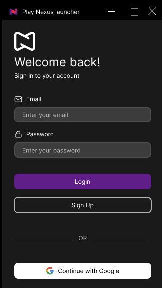
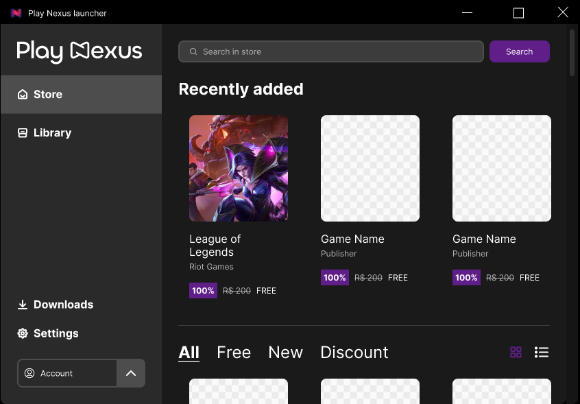
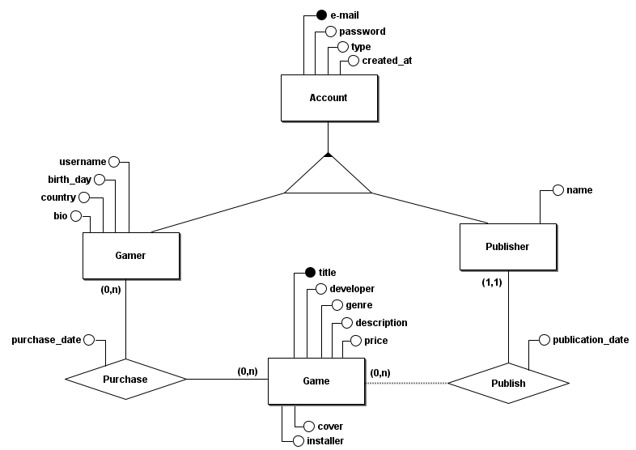

[](https://github.com/iyksh/PlayNexus/LICENSE)
[](./res/README_PTBR.md)

# PlayNexus


<div style="display: flex;">
    
    
</div>


> NOTA:
>
> Para este arquivo em Português, clique aqui no ícone acima.

## Introduction

PlayNexus is an open-source Steam clone developed in Python 3.11.2+. The project aims to provide users with a comprehensive game management platform that allows them to:

- Browse and purchase computer games in a user-friendly store;
- Manage their game library (list, add, remove and edit);
- Create a custom profile and interact with other players;
- And play a countless games and have fun like never before.

The graphical interface is built using `customtkinter` to ensure a user-friendly experience. The backend is powered by a MySQL database.

## Project Devs

| Category  | Name             |
| --------- | ---------------- |
| ALL       | Guilherme Santos |
| BACK-END  | Lucas, Franklin  |
| FRONT-END | Arthur, Mateus   |

## Structure

```sh
├── README.md
├── res/                    # Images, sounds, etc.
├── src/                    # Source code
│   ├── login/
│   ├── main.py
└── run.sh                  # Main running file
```
## Database ER Model

<div style="display: flex;">
    
</div>

## Product Backlog

> * As an administrator, I would like to register a game.
> * As an administrator, I would like to search for a registered game.
> * As an administrator, I would like to view information about a registered game, including sales quantity and revenue generated.
> * As a user, I would like to create an account.
> * As a user, I would like to search for a game in the store.
> * As a user, I would like to view information about a game in the store.
> * As a user, I would like to purchase a game in the store.
> * As a user, I would like to view my shopping cart in the store.
> * As a user, I would like to view the games that are in my library.
> * As a user, I would like to start a game from my library.
> * As a user, I would like to have a profile visible to other users.
> * As a user, I would like to search for other users' profiles.
> * As a user, I would like to customize my profile.
> * As a user, I would like other users to be able to view on my profile the games I have in my library and which ones I have recently played.


## 1st Sprint Backlog

> #### **As an administrator, I would like to register a game.**
>
> * Structure the database to store game information | **Lucas**
> * Create the game registration form in the graphical interface | **Mateus**
> * Implement validations in the game registration form | **Arthur**
> * Develop the backend logic to process game registration | **Franklin**
> * Perform tests and adjustments to ensure the game registration process works correctly | **Guilherme Santos**

> #### **As a user, I would like to create an account.**
>
> * Structure the database to store user accounts | **Lucas**
> * Develop the user account creation interface | **Arthur**
> * Implement the necessary validations to ensure the input data is correct | **Mateus**
> * Develop the backend logic to process user account creation | **Franklin**
> * Test the user account creation process to ensure its functionality | **Guilherme Santos**

> #### **As a user, I would like to buy a game in the store.**
>
> * Structure the database to store purchase information | **Franklin**
> * Develop the game purchase interface in the store | **Mateus and Arthur**
> * Implement the backend logic to process purchases | **Lucas**
> * Test the entire purchase process to ensure it is working correctly | **Guilherme Santos**

> #### **As a user, I would like to view the games that are in my library.**
>
> * Configure the database to store the user's library game information | **Lucas**
> * Create the interface to view the user's game library | **Mateus and Arthur**
> * Develop the backend logic to manage the game library view | **Franklin**
> * Perform tests to ensure the game library is displayed correctly | **Guilherme Santos**

> #### **As a user, I would like to start a game from my library.**
>
> * Structure the database to store game installation information | **Lucas**
> * Develop the interface to start games from the library | **Mateus and Arthur**
> * Implement the backend logic to allow game initialization from the library | **Franklin**
> * Test and adjust the game initialization process to ensure it works correctly | **Guilherme Santos**
