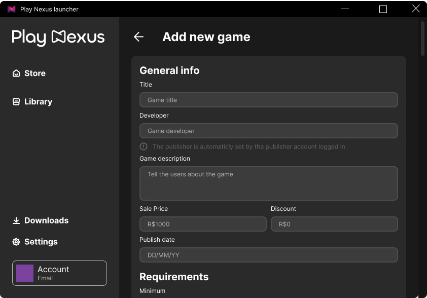
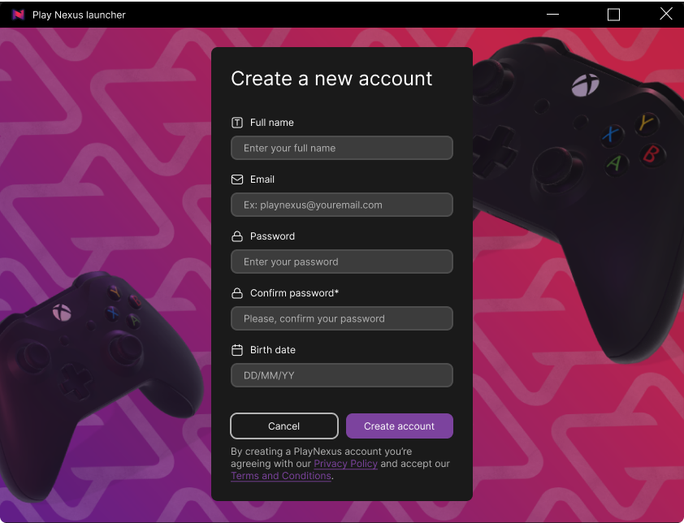
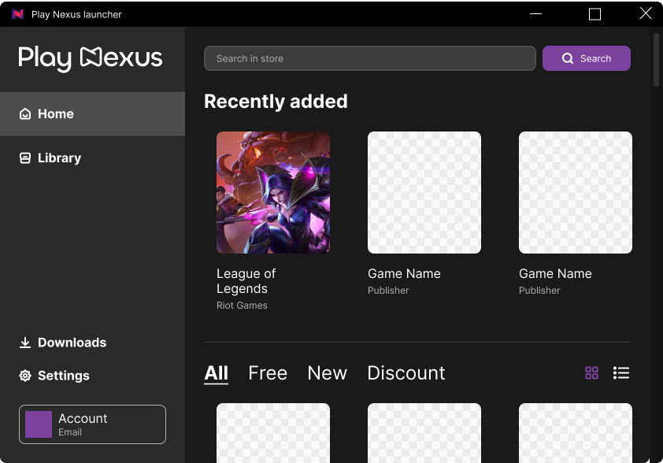
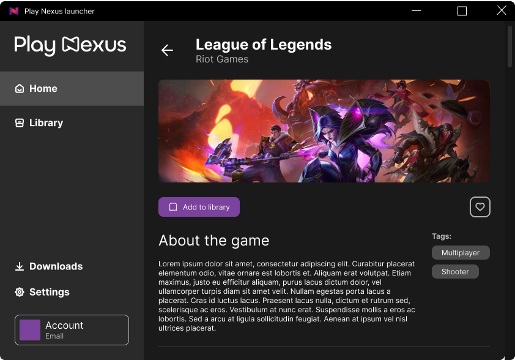
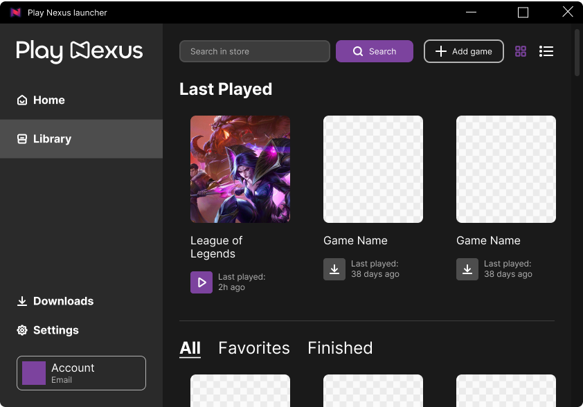
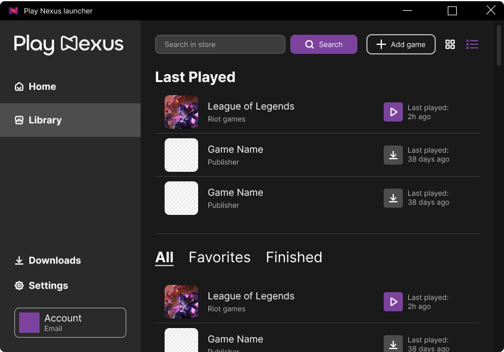

## 1st Sprint Backlog

> #### **As a publisher, I would like to register a game.**
>
> * Structure the database to store game information | **Lucas**
> * Create the game registration form in the graphical interface | **Mateus**
> * Implement validations in the game registration form | **Arthur**
> * Develop the backend logic to process game registration | **Franklin**
> * Perform tests and adjustments to ensure the game registration process works correctly | **Guilherme Santos**

    

> #### **As a gamer, I would like to create an account.**
>
> * Structure the database to store user accounts | **Lucas**
> * Develop the user account creation interface | **Arthur**
> * Implement the necessary validations to ensure the input data is correct | **Mateus**
> * Develop the backend logic to process user account creation | **Franklin**
> * Test the user account creation process to ensure its functionality | **Guilherme Santos**

    

> #### **As a gamer, I would like to see a game settings in the store.**
>
> * Structure the database to store purchase information | **Franklin**
> * Develop the game purchase interface in the store | **Mateus and Arthur**
> * Implement the backend logic to process the games to the frontend | **Lucas**
> * Test the entire process to ensure it is working correctly | **Guilherme Santos**

    
    

> #### **As a gamer, I would like to view the games that are in my home.**
>
> * Configure the database to store the user's library game information | **Lucas**
> * Create the interface to view the user's game library | **Mateus and Arthur**
> * Develop the backend logic to manage the game library view | **Franklin**
> * Perform tests to ensure the game library is displayed correctly | **Guilherme Santos**

    
    

> #### **As a gamer, I would like to search a game from my library.**
>
> * Structure the database to store game information | **Lucas**
> * Develop the interface to search games from the library | **Mateus and Arthur**
> * Test and adjust the game initialization process to ensure it works correctly | **Guilherme Santos**

    
    

