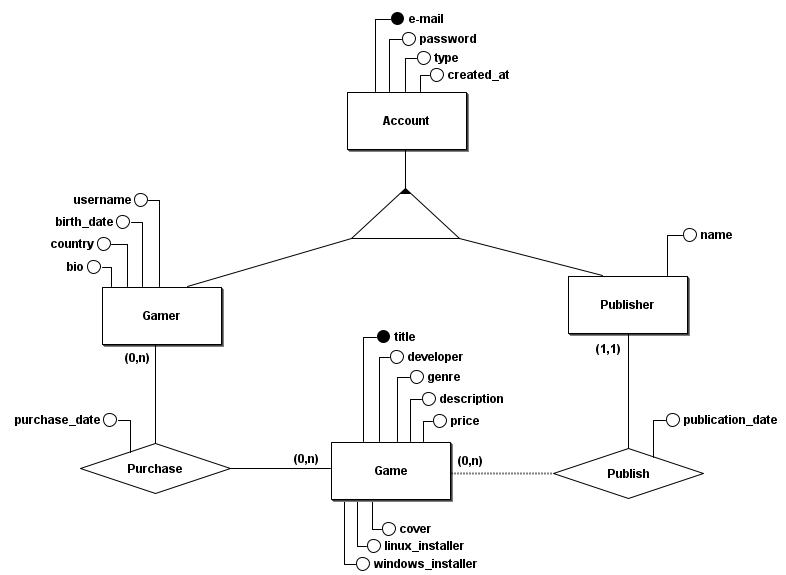

## Database ER Model

This entity-relationship (ER) diagram represents a system for managing user accounts, game purchases, and publishing information. Let's break it down by entity and relationship:

    

### Entities:

1. **Account**:

   - Attributes:
     - `e-mail`: Identifies the account (likely a primary key).
     - `password`: The password for the account.
     - `type`: The type of account (could differentiate between Gamer and Publisher).
     - `created_at`: The date the account was created.
2. **Gamer**:

   - Attributes:
     - `username`: The gamer’s username.
     - `birth_date`: Date of birth of the gamer.
     - `country`: Country of the gamer.
     - `bio`: A biography or description about the gamer.
   - Relationships:
     - `Account`: Each gamer must have an associated account (`1,1` relationship).
     - `Purchase`: A gamer can make multiple purchases (`0,n` relationship).
3. **Publisher**:

   - Attributes:
     - `name`: Name of the publisher.
   - Relationships:
     - `Account`: Each publisher must have an associated account (`1,1` relationship).
     - `Publish`: A publisher can publish multiple games (`0,n` relationship).
4. **Game**:

   - Attributes:
     - `title`: Title of the game (likely a primary key).
     - `developer`: The developer of the game.
     - `genre`: The genre of the game.
     - `description`: A description of the game.
     - `price`: The price of the game.
     - `cover`: The cover image or artwork of the game.
     - `linux_installer`: Indicates whether there is a Linux installer.
     - `windows_installer`: Indicates whether there is a Windows installer.
   - Relationships:
     - `Purchase`: A game can be purchased by many gamers (`0,n` relationship).
     - `Publish`: A game is published by one publisher (`1,1` relationship).
5. **Purchase**:

   - Attributes:
     - `purchase_date`: The date of the purchase.
   - Relationships:
     - Connects the `Gamer` to the `Game` entity. A gamer can purchase multiple games, and a game can be purchased by multiple gamers.
6. **Publish**:

   - Attributes:
     - `publication_date`: The date when the game was published.
   - Relationships:
     - Links the `Publisher` to the `Game` entity, indicating that a publisher can publish multiple games.

### Relationships:

- **Account-Gamer/Publisher**: Every gamer and publisher must have an account, but an account can either be linked to a gamer or a publisher (not both).
- **Gamer-Purchase-Game**: Gamers can make purchases of multiple games, and each game can be purchased by many gamers.
- **Publisher-Publish-Game**: A publisher can publish many games, but each game is published by exactly one publisher.

This ER model provides a clear representation of how accounts, gamers, publishers, games, and purchases interact in a system designed to manage video game distribution and player accounts.
