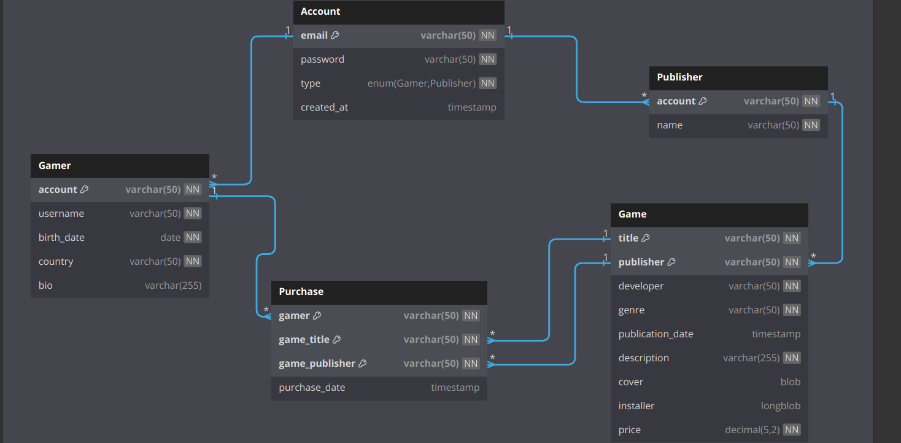

# Relational Model

## 1. Account

- **Primary Key**: `email`

| Column     | Data Type                  | Constraints               |
| ---------- | -------------------------- | ------------------------- |
| email      | VARCHAR(50)                | PRIMARY KEY, NOT NULL     |
| password   | VARCHAR(50)                | NOT NULL                  |
| type       | ENUM('Gamer', 'Publisher') | NOT NULL                  |
| created_at | TIMESTAMP                  | DEFAULT CURRENT_TIMESTAMP |

## 2. Gamer

- **Primary Key**: `account`
- **Foreign Key**: `account` references `Account(email)`

| Column     | Data Type    | Constraints                                                                    |
| ---------- | ------------ | ------------------------------------------------------------------------------ |
| account    | VARCHAR(50)  | PRIMARY KEY, NOT NULL, FOREIGN KEY REFERENCES Account(email) ON DELETE CASCADE |
| username   | VARCHAR(50)  | NOT NULL                                                                       |
| birth_date | DATE         | NOT NULL                                                                       |
| country    | VARCHAR(50)  | NOT NULL                                                                       |
| bio        | VARCHAR(255) |                                                                                |

## 3. Publisher

- **Primary Key**: `account`
- **Foreign Key**: `account` references `Account(email)`

| Column  | Data Type   | Constraints                                                                    |
| ------- | ----------- | ------------------------------------------------------------------------------ |
| account | VARCHAR(50) | PRIMARY KEY, NOT NULL, FOREIGN KEY REFERENCES Account(email) ON DELETE CASCADE |
| name    | VARCHAR(50) | NOT NULL                                                                       |

## 4. Game

- **Primary Key**: `title`, `publisher` (Composite Key)
- **Foreign Key**: `publisher` references `Publisher(account)`

| Column           | Data Type    | Constraints                                                                                    |
| ---------------- | ------------ | ---------------------------------------------------------------------------------------------- |
| title            | VARCHAR(50)  | PRIMARY KEY (composite), NOT NULL                                                              |
| publisher        | VARCHAR(50)  | PRIMARY KEY (composite), NOT NULL, FOREIGN KEY REFERENCES Publisher(account) ON DELETE CASCADE |
| developer        | VARCHAR(50)  | NOT NULL                                                                                       |
| genre            | VARCHAR(50)  | NOT NULL                                                                                       |
| publication_date | TIMESTAMP    | DEFAULT CURRENT_TIMESTAMP                                                                      |
| description      | VARCHAR(255) | NOT NULL                                                                                       |
| cover            | BLOB         |                                                                                                |
| installer        | LONGBLOB     |                                                                                                |
| price            | DECIMAL(5,2) | NOT NULL                                                                                       |

## 5. Purchase

- **Primary Key**: `gamer`, `game_title`, `game_publisher` (Composite Key)
- **Foreign Key**:
  - `gamer` references `Gamer(account)`
  - `game_title`, `game_publisher` reference `Game(title, publisher)`

| Column         | Data Type   | Constraints                                                                                 |
| -------------- | ----------- | ------------------------------------------------------------------------------------------- |
| gamer          | VARCHAR(50) | PRIMARY KEY (composite), NOT NULL, FOREIGN KEY REFERENCES Gamer(account) ON DELETE CASCADE  |
| game_title     | VARCHAR(50) | PRIMARY KEY (composite), NOT NULL, FOREIGN KEY REFERENCES Game(title) ON DELETE CASCADE     |
| game_publisher | VARCHAR(50) | PRIMARY KEY (composite), NOT NULL, FOREIGN KEY REFERENCES Game(publisher) ON DELETE CASCADE |
| purchase_date  | TIMESTAMP   | DEFAULT CURRENT_TIMESTAMP                                                                   |
