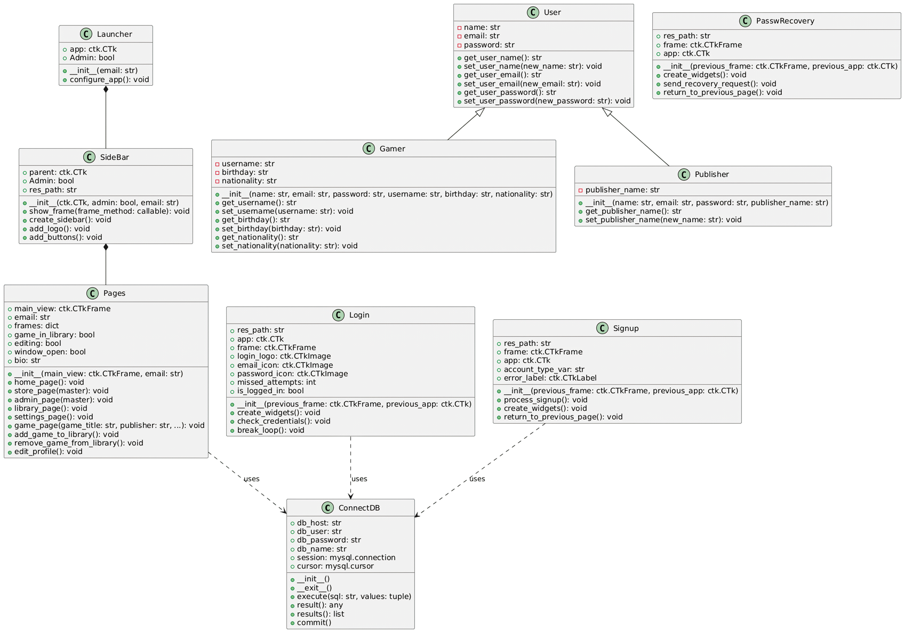

# UML Class Diagram - PlayNexus System

This document provides an overview of the **UML Class Diagram** of the PlayNexus system, describing the structure, relationships, and responsibilities of each class. The class diagram details how the different parts of the system are connected and interact with each other.

## General Description

The PlayNexus system consists of several classes that handle various aspects, from database connection to graphical interface interaction and user management. The following class diagram illustrates the organization and relationships between these classes.

## Diagram Structure

The class diagram is composed of the following main components:

### 1. **Class `ConnectDB`**

- **Responsibility**: Handles the connection to the MySQL database and executes SQL queries.
- **Attributes**:
  - `db_host`: Database host name.
  - `db_user`: Database username.
  - `db_password`: Database password.
  - `db_name`: Database name.
  - `session`: Database connection object.
  - `cursor`: Cursor object to execute SQL queries.
- **Methods**:
  - `__init__()`: Initializes the database connection.
  - `execute()`: Executes an SQL query with parameters.
  - `result()`: Returns a single query result.
  - `results()`: Returns all query results.
  - `commit()`: Commits transactions to the database.

### 2. **Class `User`**

- **Responsibility**: Base class to represent a user in the system.
- **Attributes**:
  - `name`: User's name.
  - `email`: User's email.
  - `password`: User's password.
- **Methods**:
  - `get_user_name()`, `set_user_name()`: Manipulates the user's name.
  - `get_user_email()`, `set_user_email()`: Manipulates the user's email.
  - `get_user_password()`, `set_user_password()`: Manipulates the user's password.

### 3. **Class `Gamer` (inherits from `User`)**

- **Responsibility**: Represents a gamer in the system.
- **Attributes**:
  - `username`: Gamer's username.
  - `birthday`: Gamer's birth date.
  - `nationality`: Gamer's nationality.
- **Methods**:
  - `get_username()`, `set_username()`: Manipulates the username.
  - `get_birthday()`, `set_birthday()`: Manipulates the birth date.
  - `get_nationality()`, `set_nationality()`: Manipulates the nationality.

### 4. **Class `Publisher` (inherits from `User`)**

- **Responsibility**: Represents a publisher in the system.
- **Attributes**:
  - `publisher_name`: Publisher's name.
- **Methods**:
  - `get_publisher_name()`, `set_publisher_name()`: Manipulates the publisher's name.

### 5. **Class `Pages`**

- **Responsibility**: Manages the different pages in the graphical interface.
- **Attributes**:
  - `main_view`: Reference to the main frame.
  - `email`: Current user's email.
  - `frames`: Dictionary that stores the different frames in the interface.
- **Methods**:
  - `home_page()`, `store_page()`, `admin_page()`: Manages different application pages.
  - `add_game_to_library()`, `remove_game_from_library()`: Manages the game library.

### 6. **Class `SideBar` (inherits from `Pages`)**

- **Responsibility**: Adds the navigation sidebar to the application.
- **Attributes**:
  - `parent`: Reference to the main application.
  - `Admin`: Determines if the user has admin privileges.
- **Methods**:
  - `create_sidebar()`: Creates the sidebar with navigation buttons.
  - `add_logo()`, `add_buttons()`: Adds the logo and buttons to the sidebar.

### 7. **Class `Login`**

- **Responsibility**: Handles the user login process.
- **Attributes**:
  - `app`: Reference to the main application.
  - `frame`: The login screen frame.
- **Methods**:
  - `check_credentials()`: Verifies the user's login credentials.
  - `create_widgets()`: Creates the elements of the login screen.

### 8. **Class `PasswRecovery`**

- **Responsibility**: Handles password recovery.
- **Methods**:
  - `send_recovery_request()`: Sends the password recovery request.
  - `return_to_previous_page()`: Returns to the login page.

### 9. **Class `Signup`**

- **Responsibility**: Handles the user signup process.
- **Methods**:
  - `process_signup()`: Processes signup information and creates a new user.
  - `return_to_previous_page()`: Returns to the login page.

### 10. **Class `Launcher`**

- **Responsibility**: The main class that initializes the system.
- **Attributes**:
  - `app`: Reference to the main application.
  - `Admin`: Determines if the user has admin privileges.
- **Methods**:
  - `configure_app()`: Configures the main application window.

## Relationships

- **Inheritance**:

  - `User` is the base class for `Gamer` and `Publisher`.
- **Associations**:

  - `ConnectDB` is used by various classes (`Pages`, `Login`, `Signup`) to interact with the database.
  - `SideBar` inherits from `Pages`, adding the navigation functionality.

## Class Diagram

Here is the class diagram of the system:

## Conclusion

The class diagram above provides a detailed view of the internal structure of the PlayNexus system, showing the responsibilities and interactions of the main classes. It serves as a valuable tool to understand how the system is organized and how its components interact.
